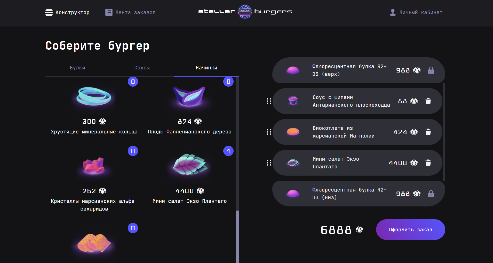

<h1 align="center">Space Burger</h1>

Web application for ordering in a burger shop using the burger constructor

## What is this web application for? 🤷‍♀️

It is an interactive application that allows the user to conveniently assemble their own special burger using the constructor.

Also for registered users, you can view the order history. The user can see the order feed - a list of burgers that are being prepared right now or are already ready. This functionality is available live thanks to the web socket connection.

## Features

- Registration and authorization of users
- The ability to collect your own special burger with the help of drag and drop
- View user's order history
- Overview of already collected and preparing burgers
- Ability to edit user data in your personal account

## Setting up development environment 🛠

- `git clone https://github.com/MaksimPozharskiy/space-burger-react.git`
- `npm install`
- `npm run start`
- App should now be running on `http://localhost:3001/`

## Running cypress end-to-end tests 🚥

- Set up development environment
- `npm run start`
- `npm run cypress` in another terminal

## Link to the project
- `https://maksimpozharskiy.github.io/space-burger-react/`